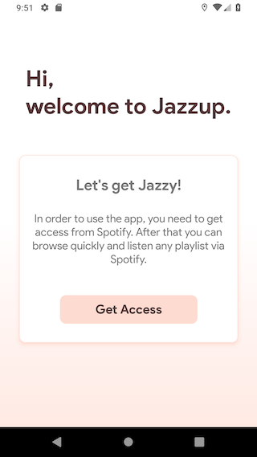
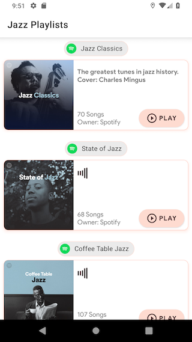
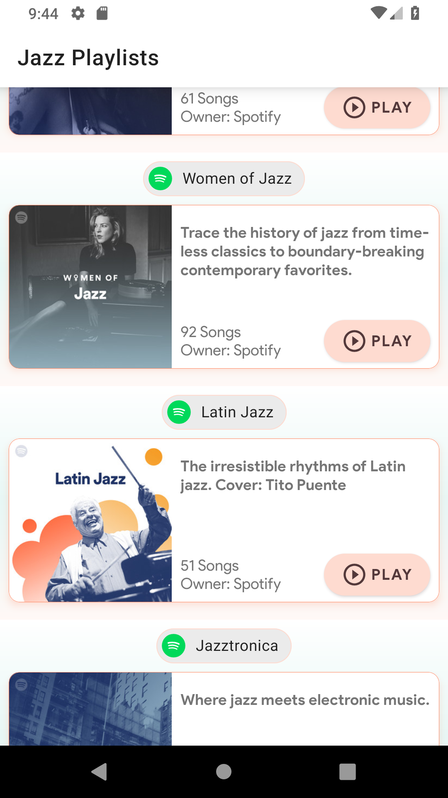

Jazzup
--------------------
This is a demonstration project that uses Spotify API to list Jazz playlists and enable user to listen a playlist on Spotify application. In order to run, you need to get a client id and client secret keys from Spotify and place these values into `key.properties` file.
To access the playlists and other details in Spotify API, I've used **Client Credentials Flow** and it requires to refresh access token in every `3600 seconds`.

    Authoriztion Endpoint
    POST https://accounts.spotify.com/api/token

Main Tech Stack
--------------------
 - Java + Kotlin
 -  MVP Architecture
 -  Dagger 2
 -  RxJava 2 + RxAndroid
 -  Mockito
 -  Material Components

Demo
----
 

 

Developed By
---------------
* Can Uludağ
* cucanuludag@gmail.com
* https://www.linkedin.com/in/canuludag/

License
----------
    Copyright 2018 Can Uludağ

    Licensed under the Apache License, Version 2.0 (the "License");
    you may not use this file except in compliance with the License.
    You may obtain a copy of the License at

       http://www.apache.org/licenses/LICENSE-2.0

    Unless required by applicable law or agreed to in writing, software
    distributed under the License is distributed on an "AS IS" BASIS,
    WITHOUT WARRANTIES OR CONDITIONS OF ANY KIND, either express or implied.
    See the License for the specific language governing permissions and
    limitations under the License.